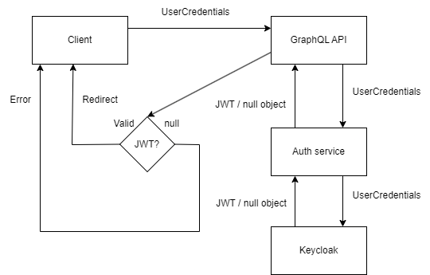

# Login to the application

## Overview

The majority of the login process is handled by Keycloak as it is
the issuer of the JWT tokens.

## Workflow

1. Client (front-end) sends a login request with UserCredentials to the GraphQL API.
2. GraphQL API forwards this request to the Auth microservice.
3. Auth service sends a request with given UserCredentials to the Keycloak instance.
4. Keycloak validates the UserCredentials & issues the JWT token if valid.
If the credentials are invalid, it returns a null object within the response to the auth service.
5. Auth service checks the response from the Keycloak instance.
If the token != null -> it returns JWT token to the client, else returns 403-forbidden response.

### Diagram

